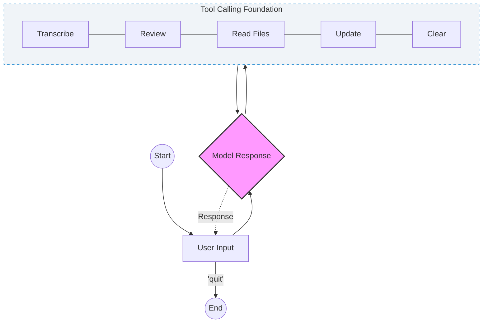

# 🎼 MAYA: Musical Agent Yar Ahang 

The Agentic Music Transcriber

Maya is an intelligent assistant designed to turn sheet music images into playable MusicXML files. It doesn't just "run code"; it uses a **tiered reasoning approach** to ensure you get a transcription even when standard OMR (Optical Music Recognition) fails.



## ✨ Key Features

* **Tiered Transcription:** 1.  **Tier 1 (Precision):** Uses `oemer` for specialized Optical Music Recognition.
    2.  **Tier 2 (Vision LLM):** Falls back to Claude’s vision capabilities if OMR fails or encounters environment errors.
* **Agentic Self-Correction:** If a file path is mistyped, Maya automatically lists the workspace files to find the correct match and retries the operation.
* **Visual & Audio Feedback:** Automatically renders a visual representation and generates an MP3/MIDI playback for instant review using `fluidsynth`.
* **Human-in-the-loop:** Easily update or correct specific notes via natural language.

## 🛠️ Tech Stack
* **Orchestration**: LangGraph (Cyclic Graph state management)
* **Framework**: LangChain (LLM abstractions & Tool calling)
* **Vision/LLM**: Claude 3.5 Sonnet (via Anthropic)
* **OMR**: Oemer (Tier 1 Transcription)
* **Core:** Python 3.13
* **Orchestration:** [LangGraph](https://github.com/langchain-ai/langgraph) (for the state-based agent logic)
* **LLM:** Claude 3.5 / 3.7 (via LangChain)
* **OMR Engine:** `oemer`
* **Audio/Visual:** `pygame`, `fluidsynth`, and custom `music_helper` utilities.

## 🧠 Agent Logic
* Maya uses a LangGraph-driven state machine to decide the best path for your music
* OMR Node: Attempts deep structural analysis of the sheet music.
* Vision Fallback Node: If OMR fails, the agent uses Claude 3.5 Sonnet's vision capabilities to describe and transcribe the score.
* Synthesis Node: Converts the identified notes into MIDI, MP3, and MusicXML.

## 🚀 Quick Start

1.  **Install Dependencies:**
    ```bash
    pip install -r requirements.txt
    ```
2.  **Set up Environment:**
    Ensure you have your `ANTHROPIC_API_KEY` set in your environment variables.
3.  **Run Maya:**
    ```bash
    python maya.py
    ```
---
*Developed with a focus on resilient AI workflows.*
